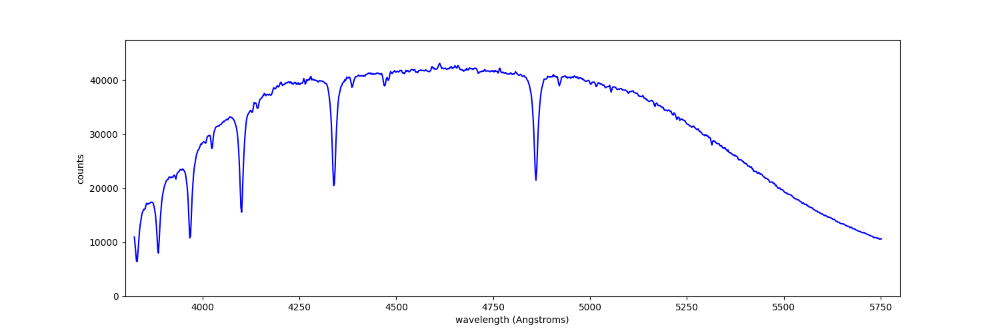

# Astronomical Spectra Reduction

This academic project documents a scientific Python workflow for reducing two-dimensional CCD spectroscopy data into a calibrated one-dimensional spectrum. It demonstrates FITS handling, calibration-frame construction, image correction, background modeling, spectral extraction, wavelength calibration, and scientific visualization.

## Objective

Transform raw spectrograph exposures into a usable hot-star spectrum while correcting for detector bias, dark current, pixel-response variation, and sky/background signal.

## Tools and Technologies

- Python
- NumPy and SciPy
- Astropy (`astropy.io.fits`, `CCDData`, coordinates, units, and time utilities)
- `ccdproc`
- Matplotlib
- Jupyter Notebook

## Workflow

1. Read the observation log and organize bias, dark, flat-field, wavelength-calibration, and science exposures.
2. Combine calibration frames with sigma clipping to create master bias, dark, and flat products.
3. Apply bias subtraction, dark subtraction, trimming, and flat-field correction to the science exposure.
4. Trace the spectrum and fit the surrounding background while rejecting outlying pixels from the background estimate.
5. Subtract the modeled background and optimally extract the signal into a one-dimensional spectrum.
6. Apply a wavelength solution using a calibration exposure and template line data.
7. Export the reduced spectrum as FITS and text products and plot flux counts against wavelength.

## Key Results and What This Demonstrates

- Produces a reduced hot-star spectrum over approximately 3,800–5,800 Å.
- Shows how multiple detector corrections feed into a single scientific data product.
- Demonstrates practical use of astronomical file formats, calibration frames, polynomial fitting, sigma clipping, and spectral visualization.
- Preserves representative intermediate and final outputs so the processing stages can be inspected.

This repository is an academic spectroscopy-reduction exercise and is separate from my undergraduate research work.

## Visualization

The repository also includes [`try_background_fit.png`](try_background_fit.png), which shows an example background fit used during extraction.

## Repository Contents

| Path | Description |
| --- | --- |
| [`Project1.ipynb`](Project1.ipynb) | End-to-end reduction notebook |
| `Master*.fits` and `Processed_WaveCal.fits` | Representative calibration products |
| `background.fit` and `bkgnd_subtracted.fit` | Background model and background-subtracted data |
| `Hot_Star.fit` and `Hot_Star.txt` | Extracted one-dimensional spectrum |
| `template*.dat` | Wavelength-calibration template data |
| `Hot_Star.png` | Final spectrum visualization |

## Viewing and Reproducibility Notes

[View the notebook in nbviewer](https://nbviewer.org/github/Salgadod123/Spectra-Reduction-school-project/blob/main/Project1.ipynb) if GitHub does not render every notebook output.

The notebook references local raw observations and course-provided helper modules (`srp2` and `wcalib`) that are not included in this repository. The repository therefore documents the workflow and representative products rather than serving as a fully self-contained reduction package.
